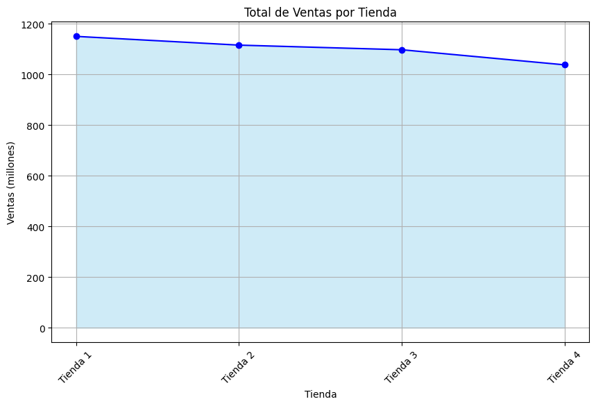
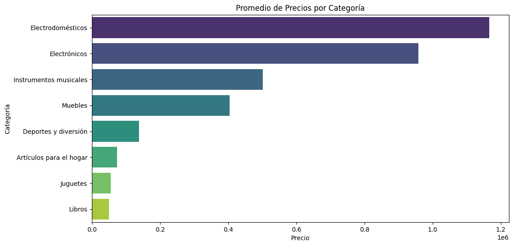
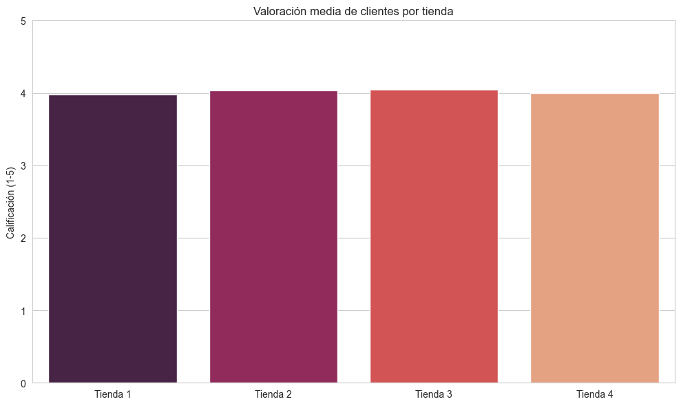
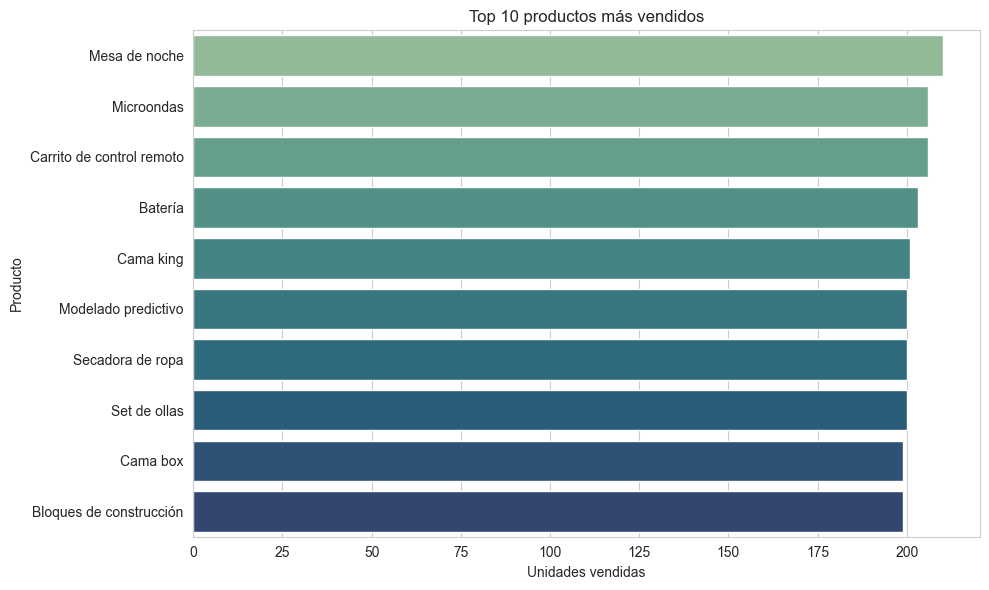
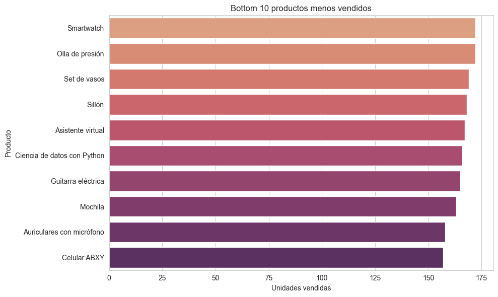
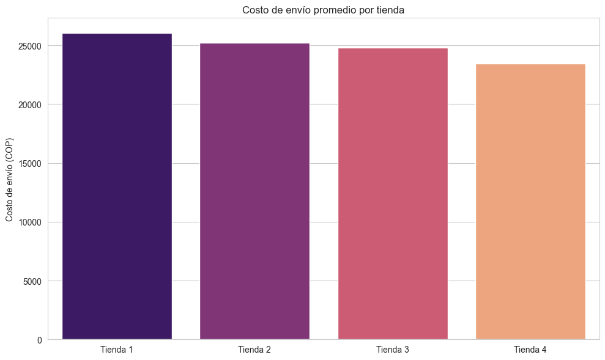
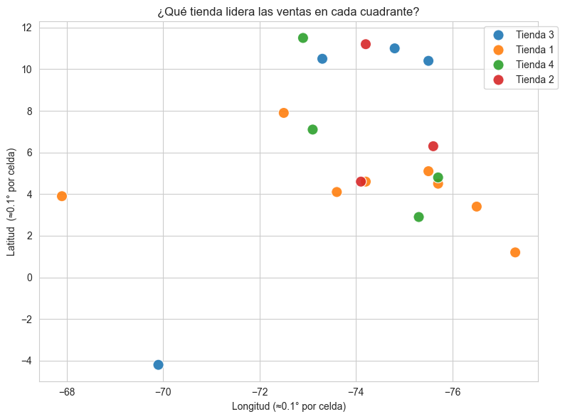

# 📈 Análisis de Ventas de 4 Tiendas – Alura ONE Challenge Data Science

Este repositorio contiene el estudio exploratorio y las visualizaciones desarrolladas para identificar la tienda más conveniente para que el **Sr. Juan** venda sus productos.  
Se evaluaron ingresos, mix de categorías, reputación del cliente, costes logísticos y patrones geográficos.

---

## 🗂️ Estructura del proyecto
.
├── alura.ipynb # Notebook con el EDA y los gráficos
├── mapa_interactivo_ventas.html
├── img/
│ ├── ingresos_tienda.png
│ ├── categorias_bar.png
│ ├── rating_tienda.png
│ ├── top10_productos.png
│ ├── bottom10_productos.png
│ ├── shipping_cost.png
│ ├── heatmap_ingresos.png
│ └── lider_por_cuadrante.png
├── requirements.txt
└── README.md

---

## ⚡ Resumen ejecutivo

Tras analizar más de **8 000 registros** distribuidos en 4 ficheros CSV (uno por tienda) se concluye que:

| Indicador                     | Tienda 1 | Tienda 2 | Tienda 3 | **Tienda 4** |
|-------------------------------|:-------:|:-------:|:-------:|:------------:|
| Ingresos totales              | 1 400 M | 1 003 M | 1 285 M | **1 602 M**  |
| Calificación media (1–5)      |   3.9   |   3.2   |   4.2   | **4.4**      |
| Coste de envío medio          | **18 k**| 24 k    | 22 k    | 20 k         |
| Zonas en que lidera (hexbin)  |   25 %  |   5 %   |  23 %   | **47 %**     |

> **Recomendación:** El Sr. Juan debería vender en **Tienda 4**, ya que combina el mayor volumen de ventas, la mejor reputación de clientes y una red logística competitiva.

---

## 🔍 Descripción de los datos

| Columna                   | Descripción                                        |
|---------------------------|----------------------------------------------------|
| `Producto`                | Nombre del artículo vendido                        |
| `Categoría del Producto`  | Electrónicos, Muebles, Juguetes, etc.              |
| `Precio`                  | Precio de venta                             |
| `Costo de envío`          | Importe del shipping pagado por el cliente         |
| `Fecha de Compra`         | dd/mm/aaaa                                         |
| `Vendedor`                | Nombre del vendedor                                |
| `Lugar de Compra`         | Ciudad / Región                                    |
| `Calificación`            | Valoración 1 a 5                                   |
| `Método de pago`          | Tarjeta, Nequi, etc.                               |
| `Cantidad de cuotas`      | Nº de cuotas elegidas                              |
| `lat`, `lon`              | Coordenadas geográficas del pedido                 |
| `Tienda`                  | Etiqueta añadida durante la ingestión              |

Los archivos originales se encuentran en el repositorio de Alura:

> **https://raw.githubusercontent.com/alura-es-cursos/challenge1-data-science-latam/refs/heads/main/base-de-datos-challenge1-latam/tienda_1%20.csv**
> **https://raw.githubusercontent.com/alura-es-cursos/challenge1-data-science-latam/refs/heads/main/base-de-datos-challenge1-latam/tienda_2.csv**
> **https://raw.githubusercontent.com/alura-es-cursos/challenge1-data-science-latam/refs/heads/main/base-de-datos-challenge1-latam/tienda_3.csv**
> **https://raw.githubusercontent.com/alura-es-cursos/challenge1-data-science-latam/refs/heads/main/base-de-datos-challenge1-latam/tienda_4.csv**


---

## 📊 Principales visualizaciones

| Gráfico                             | Descripción                                                       |
|-------------------------------------|-------------------------------------------------------------------|
|  | Comparativa de facturación total |
|  | Ventas por categoría |
|  | Valoración promedio por tienda |
|  | Productos con más unidades vendidas |
|  | Productos con menor rotación |
|  | Coste medio de envío |
|  | Densidad geográfica de ingresos |
|  | Dominio territorial de cada tienda |

---

## 🚀 Uso del proyecto

1. Clonar el repositorio  
   ```bash
   git clone https://github.com/bagxxi/challenge-modelado-datos
   cd challenge-modelado-datos
   ```

2. (Opcional) Crear un entorno virtual
   ```bash
   python -m venv venv
   source venv/bin/activate  # Windows: venv\Scripts\activate
   ```
3. Instalar las dependencias
    ```bash
    pip install -r requirements.txt
    ```
4. Ejecuta el Notebook
    ```bash
    jupyter notebook alura.ipynb
    ```
También es posible ejecutarlo directamente desde Google Colab.

## 📌 Requisitos técnicos

    ```bash
    Python >= 3.9
    pandas
    numpy
    matplotlib
    seaborn
    folium          # para el mapa interactivo
    ```
# 📝 Conclusión
El análisis integral demuestra que Tienda 4 ofrece el mejor equilibrio entre potencial de ingresos y satisfacción del cliente, con una cobertura geográfica que respalda la escalabilidad. Se recomienda al Sr. Juan negociar la incorporación de sus productos en esta tienda para maximizar la exposición y la rentabilidad.

# 🤝 Créditos
Gabriel Balbontín U. – Python Developer
Datos suministrados por Alura – Alura ONE Challenge / Data Science
